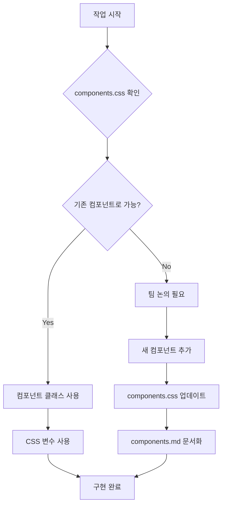

# Claude 개발 지침

## 🚨 최우선 규칙: 컴포넌트 우선 원칙 (Component-First Principle)

### 필수 준수 사항

**⚠️ 모든 UI 개발 작업 시 반드시 다음 프로세스를 따라야 합니다:**

1. **기존 컴포넌트 검토 (MANDATORY - 절대 생략 불가)**
   ```
   1단계: /assets/css/components.css 파일 완전 검토
   2단계: /components.md 페이지에서 시각적 확인
   3단계: 해당 컴포넌트 클래스와 구조 파악
   4단계: 기존 컴포넌트로 구현 가능 여부 판단
   ```

2. **컴포넌트 재사용 원칙**
   - ❌ 새로운 스타일 작성 금지 (기존 컴포넌트로 해결 가능한 경우)
   - ❌ 인라인 스타일 사용 금지
   - ❌ 커스텀 CSS 클래스 생성 금지 (불가피한 경우 외)
   - ✅ 기존 컴포넌트 클래스 조합으로 해결

3. **디자인 시스템 준수**
   - 모든 색상은 CSS 변수 사용 (--color-primary 등)
   - 모든 간격은 spacing 변수 사용 (--spacing-sm 등)
   - 모든 폰트 크기는 font-size 변수 사용
   - 하드코딩된 값 절대 금지

---

## 📋 작업 전 체크리스트

```markdown
[ ] components.css 파일을 열어서 전체 컴포넌트 확인했는가?
[ ] components.md 페이지에서 실제 렌더링 확인했는가?
[ ] 필요한 UI가 기존 컴포넌트로 구현 가능한가?
[ ] 디자인 토큰(CSS 변수)을 사용하고 있는가?
[ ] 인라인 스타일을 사용하지 않았는가?
```

---

## 🎨 핵심 컴포넌트 레퍼런스

### 버튼 컴포넌트
```html
<!-- 절대 이렇게 하지 마세요 -->
<button style="padding: 10px; background: purple;">버튼</button>
<span class="custom-button">버튼</span>

<!-- 반드시 이렇게 하세요 -->
<button class="btn btn-primary">버튼</button>
<button class="btn btn-secondary">버튼</button>
<button class="btn btn-ghost">버튼</button>
```

### 카드 컴포넌트
```html
<!-- 절대 이렇게 하지 마세요 -->
<div style="border: 1px solid #ccc; padding: 20px;">카드</div>

<!-- 반드시 이렇게 하세요 -->
<div class="card">
    <div class="card-header">
        <div class="card-title">제목</div>
        <div class="card-description">설명</div>
    </div>
    <div class="card-content">내용</div>
    <div class="card-footer">푸터</div>
</div>
```

### 태그 컴포넌트
```html
<!-- 절대 이렇게 하지 마세요 -->
<span style="background: #f0f0f0; padding: 5px;">태그</span>

<!-- 반드시 이렇게 하세요 -->
<span class="tag">태그</span>
<span class="tag tag-primary">중요</span>
<span class="tag tag-success">완료</span>
```

### 그리드 시스템
```html
<!-- 절대 이렇게 하지 마세요 -->
<div style="display: grid; grid-template-columns: 1fr 1fr;">...</div>

<!-- 반드시 이렇게 하세요 -->
<div class="grid grid-2">...</div>
<div class="grid grid-3">...</div>
<div class="grid grid-4">...</div>
```

---

## 🔴 절대 금지 사항

1. **컴포넌트 검토 없이 코드 작성 시작**
2. **"빠르게 구현하기 위해" 인라인 스타일 사용**
3. **"이번만" 하드코딩 값 사용**
4. **기존 컴포넌트 무시하고 새로 만들기**
5. **CSS 변수 대신 직접 색상/크기 값 입력**

---

## 🟢 필수 실행 사항

1. **모든 작업 시작 전 components.css 열기**
2. **components.md에서 비주얼 확인**
3. **기존 컴포넌트 클래스 사용**
4. **CSS 변수만 사용**
5. **컴포넌트 조합으로 UI 구성**

---

## 💡 Quick Commands

```bash
# 컴포넌트 CSS 확인
cat /assets/css/components.css

# 컴포넌트 데모 페이지 확인
open http://localhost:4000/components

# 사용 가능한 CSS 변수 확인
grep "^  --" /assets/css/components.css
```

---

## 📍 파일 위치

- **컴포넌트 정의**: `/assets/css/components.css`
- **컴포넌트 데모**: `/components.md`
- **토스 디자인 시스템**: `/assets/css/toss-design-system.css`
- **메인 스타일**: `/assets/css/style.scss`

---

## ⚠️ 경고

**이 규칙을 따르지 않으면:**
- 디자인 일관성 파괴
- 유지보수 어려움 증가
- 코드 중복 발생
- 디자인 시스템 붕괴

**반드시 컴포넌트 우선 원칙을 준수하세요!**

---

## 📝 업데이트 로그

- 2025-08-30: 컴포넌트 우선 원칙 추가
- Version: 1.0.0

---

## 🔄 작업 플로우



**이 문서는 Claude가 코드를 작성할 때 최우선으로 참조해야 하는 지침입니다.**